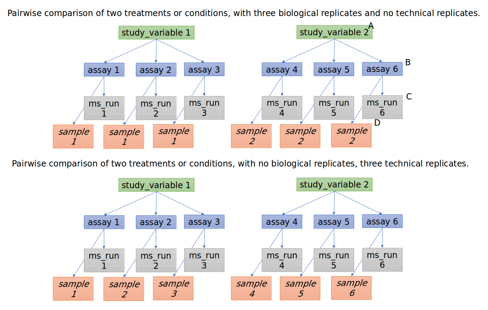

= mzTab-M: exchange format for metabolomics results
:sectnums:
:toc: left
:doctype: book
//only works on some backends, not HTML
:showcomments:
//use style like Section 1 when referencing within the document.
:xrefstyle: short
:figure-caption: Figure
:pdf-page-size: A4

//GitHub specific settings
ifdef::env-github[]
:tip-caption: :bulb:
:note-caption: :information_source:
:important-caption: :heavy_exclamation_mark:
:caution-caption: :fire:
:warning-caption: :warning:
endif::[]

//disable section numbering
:!sectnums:
[preface]
== Preface
_Status of This Document_

This document presents the final specification of the mzTab data format developed by members of the Human Proteome Organisation (HUPO) Proteomics Standards Initiative (PSI) Proteomics Informatics (PI) Working Group, in collaboration with the Metabolomics Standards initiative (MSI). Distribution is unlimited.

_Version of This Document_

The current version of this document is: version 1.1.0-draft, Aug 2017.

The latest draft version of this document may be found at https://github.com/HUPO-PSI/mzTab.

[abstract]
[[abstract]]
== Abstract

The Human Proteome Organisation (HUPO) Proteomics Standards Initiative (PSI) and Metabolomics Standards initiative (MSI) define community standards for data representation in proteomics/metabolomics to facilitate data comparison, exchange and verification. In this context, the two organizations are working together on a shared standard for downstream results, following mass spectrometry (MS) analysis. This document defines a tab-delimited text file format to report metabolomics results, based on a shared core mzTab format, also used in proteomics contexts.

//reenable section numbering
:sectnums:
[[introduction]]
== Introduction

[[background]]
=== Background

This document addresses the systematic description of small molecule identification and quantification data retrieved from mass spectrometry (MS)-based experiments. A large number of software tools are available that analyze MS data and produce a variety of different output data formats.

mzTab-M is intended as a reporting standard for quantitative results from metabolomics/lipodomics approaches. This format is also intended to provide local LIMS systems as well as MS metabolomics repositories a simple way to share and combine basic information.

mzTab has been developed with a view to support the following general tasks (more specific use cases are provided in <<use-cases-for-mztab>>):

1.  _Facilitate the sharing of final experimental results,_ especially with researchers outside the field of metabolomics.
2.  _Export of results to external software,_ including programs such as Microsoft Excel^®^ and Open Office Spreadsheet and statistical software / coding languages such as R.
3.  _Act as an output format of (web-) services_ that report MS-based results and thus can produce standardized result pages.
4.  _Be able to link to the external experimental evidence_ e.g. by referencing back to mzML files.

This document presents a specification, not a tutorial. As such, the presentation of technical details is deliberately direct. The role of the text is to describe the model and justify design decisions made. The document does not discuss how the models should be used in practice, consider tool support for data capture or storage, or provide comprehensive examples of the models in use. It is anticipated that tutorial material will be developed independently of this specification.

[[document-structure]]
=== Document Structure

The remainder of this document is structured as follows. <<use-cases-for-mztab>> lists use cases mzTab-M is designed to support. <<notational-conventions>> describes the terminology used. <<relationships-to-other-specifications>> describes how the specification presented in <<format-specification>> relates to other specifications, both those that it extends and those that it is intended to complement. <<resolved-design-and-scope-issues>> discusses the reasoning behind several design decisions taken. <<format-specification>> contains the documentation of the file. <<non-supported-use-cases>> lists use cases that are currently not supported. Conclusions are presented in <<conclusions>>.

[[use-cases-for-mztab]]
== Use Cases for mzTab

The following cases of usage have driven the development of the mzTab data model, and are used to define the scope of the format in version 1.0.

1. mzTab-M files should be simple enough to make metabolomics results accessible to people outside the respective fields. This should facilitate the sharing of data beyond the borders of the fields and make it accessible to non-experts.

2. mzTab-M files should contain sufficient information to provide an electronic summary of all findings in a metabolomics study to permit its use as a standard documentation format for ‘supplementary material’ sections of publications in metabolomics. It should thus be able to replace PDF tables as a way of reporting small molecules make published identification and quantification information more accessible.

3. mzTab-M files should enable reporting at different levels of detail: ranging from a simple summary of the final results to a detailed reporting including the experimental design.

4. It should be possible to open mzTab-M files with “standard” software such as Microsoft Excel^®^ or Open Office Spreadsheet. This should furthermore improve the usability of the format to people outside the fields of metabolomics.

5. mzTab files should make MS derived results easily accessible to scripting languages allowing bioinformaticians to develop software without the overhead of developing sophisticated parsing code. Since mzTab files will be comparatively small, the data from multiple experiments can be processed at once without requiring special resource management techniques.

6. It should be possible to contain the complete final results of an MS-based metabolomics experiment in a single file. This should furthermore reduce the complexity of sharing and processing an experiment’s final results. mzTab-M files should be able to store quantitative values for small molecule identifications.

7. It should be useful as an output format by web-services that can then be readily accessed by tools supporting mzTab-M.

8. It should be possible to directly link a small molecule record to its source spectrum in an external MS data file.

[[notational-conventions]]
== Notational Conventions

The key words “MUST,” “MUST NOT,” “REQUIRED,” “SHALL,” “SHALL NOT,” “SHOULD,” “SHOULD NOT,” “RECOMMENDED,” “MAY,” and “OPTIONAL” are to be interpreted as described in RFC-2119 <<bradner-1997, (Bradner 1997)>>.

[[relationship-to-other-specifications]]
== Relationship to Other Specifications

The specification described in this document has not been developed in isolation; indeed, it is designed to be complementary to, and thus used in conjunction with, several existing and emerging models. Related specifications include the following:

1.  _mzML_ (http://www.psidev.info/mzml). mzML is the PSI standard for capturing mass spectra / peak lists resulting from mass spectrometry in proteomics <<martens-2011, (Martens _et al._ 2011)>>. mzTab files MAY be used in conjunction with mzML, although it will be possible to use mzTab with other formats of mass spectra. This document does not assume familiarity with mzML.
2.  __ISA-TAB (__http://isa-tools.org/_)._ The ISA framework allows for reporting experimental metadata and study designs in considerable detail, and is already used for describing metabolomics experiments. It is expected that mzTab files may be linked to ISA-TAB formatted files, for cases where a rich experimental design is to be captured. The linkage between mzTab-M and ISA-TAB is further exemplified in section <<referencing-external-resources>>.

[[relationship-to-mztab-1.0]]
=== Relationship to mzTab 1.0

The first stable version of mzTab (version 1.0) was developed primarily by the PSI as a format for the final results (identification or quantification) of a proteomics experiment, using MS. In mzTab version 1.0 limited support was included for metabolomics, through a small molecule table, in which end results could be encoded at the level of quantified metabolites. The intention of mzTab-M is to extend these concepts, so that more detail can be captured about the evidence trail for quantification, including MS features (different charge states or adducts) and the evidence trail for identifications - both of which could not be easily supported in mzTab v 1.0. mzTab-M is not formally backwards compatible, but follows a similar design pattern. Design decisions made in mzTab-M may in the future be adopted for a version of mzTab specifically intended for proteomics only, but at the time of writing mzTab version 1.0 remains in active use for proteomics, but is deprecated for use in metabolomics.

[[the-psi-mass-spectrometry-controlled-vocabulary-cv]]
=== The PSI Mass Spectrometry Controlled Vocabulary (CV)

The PSI-MS controlled vocabulary is intended to provide terms for annotation of mass spectrometry-related file formats. The CV has been generated with a collection of terms from software vendors and academic groups working in the area of mass spectrometry and MS informatics. Some terms describe attributes that must be coupled with a numerical value attribute in the CvParam element (e.g. MS:1001191 “p-value”) and optionally a unit for that value (e.g. MS:1001117, “theoretical mass”, units = “dalton”). The terms that require a value are denoted by having a “datatype” key-value pair in the CV itself: MS:1000511 "ms level" value-type:xsd:int. Terms that need to be qualified with units are denoted with a “has_units” key in the CV itself (relationship: has_units: UO:0000221 ! dalton).

As recommended by the PSI CV guidelines, psi-ms.obo should be dynamically maintained via the psidev-ms-vocab@lists.sourceforge.net mailing list that allows any user to request new terms in agreement with the community involved. Once a consensus is reached among the community the new terms are added within a few business days. If there is no obvious consensus, the CV coordinators committee should vote and make a decision. A new psi-ms.obo should then be released by updating the file on the GitHub server without changing the name of the file.

The following ontologies or controlled vocabularies specified below may also be suitable or required in certain instances:

* Unit Ontology (http://www.obofoundry.org/ontology/uo.html)
* ChEBI (ftp://ftp.ebi.ac.uk/pub/databases/chebi/ontology/chebi.obo)
* OBI Ontology of Biological Investigations (http://obi-ontology.org/)
* PRIDE Controlled Vocabulary (https://www.ebi.ac.uk/ols/ontologies/pride)
* NEWT UniProt Taxonomy Database (http://www.ebi.ac.uk/ontology-lookup/browse.do?ontName=NEWT)
* BRENDA tissue/ enzyme source (http://www.brenda-enzymes.info/ontology/tissue/tree/update/update_files/BrendaTissueOBO).
* Cell Type ontology (https://raw.githubusercontent.com/obophenotype/cell-ontology/master/cl-basic.obo).

[[resolved-design-and-scope-issues]]
== Resolved Design and scope issues

There were several issues regarding the design of the format that were not clear cut, and a design choice was made that was not completely agreeable to everyone. So that these issues do not keep coming up, we document the issues here and why the decision that is implemented was made.

[[use-of-identifiers-for-input-spectra-to-a-search]]
=== Use of identifiers for input spectra to a search

Small molecules MUST be linked to an identifier of the source spectrum (in an external file) from which the identifications are made by way of a reference in the `spectra_ref` attribute and via the `ms_run` element which stores the URL of the file in the `location` attribute.

It is advantageous if there is a consistent system for identifying spectra in different file formats. The following table is implemented in the PSI-MS CV for providing consistent identifiers for different spectrum file formats.

NOTE: This table shows examples from the CV but will be extended. The CV holds the definite specification for legal encodings of spectrumID values.

[[table-1, CV Terms and Rules]]
.Controlled vocabulary terms and rules implemented in the PSI-MS CV for formulating the “nativeID” to identify spectra in different file formats.
[cols=",,,",options="header",]
|===============================================================================================================================================================================================================================================================
|*ID* |*Term* |*Data type* |*Comment*
|MS:1000768 |Thermo nativeID format |controllerType=xsd:nonNegativeInteger controllerNumber=xsd:positiveInteger scan=xsd:positiveInteger. |controller=0 is usually the mass spectrometer
|MS:1000769 |Waters nativeID format |function=xsd:positiveInteger process=xsd:nonNegativeInteger scan=xsd:nonNegativeInteger |
|MS:1000770 |WIFF nativeID format |sample=xsd:nonNegativeInteger period=xsd:nonNegativeInteger cycle=xsd:nonNegativeInteger experiment=xsd:nonNegativeInteger |
|MS:1000771 |Bruker/Agilent YEP nativeID format |scan=xsd:nonNegativeInteger |
|MS:1000772 |Bruker BAF nativeID format |scan=xsd:nonNegativeInteger |
|MS:1000773 |Bruker FID nativeID format |file=xsd:IDREF |The nativeID must be the same as the source file ID
|MS:1000774 |multiple peak list nativeID format |index=xsd:nonNegativeInteger |Used for referencing peak list files with multiple spectra, i.e. MGF, PKL, merged DTA files. Index is the spectrum number in the file, starting from 0.
|MS:1000775 |single peak list nativeID format |file=xsd:IDREF |The nativeID must be the same as the source file ID. Used for referencing peak list files with one spectrum per file, typically in a folder of PKL or DTAs, where each sourceFileRef is different
|MS:1000776 |scan number only nativeID format |scan=xsd:nonNegativeInteger |Used for conversion from mzXML, or a DTA folder where native scan numbers can be derived.
|MS:1000777 |spectrum identifier nativeID format |spectrum=xsd:nonNegativeInteger |Used for conversion from mzData. The spectrum id attribute is referenced.
|MS:1001530 |mzML unique identifier |xsd:string |Used for referencing mzML. The value of the spectrum id attribute is referenced directly.
|===============================================================================================================================================================================================================================================================

In mzTab, the spectra_ref attribute should be constructed following the data type specification in <<table-1>>. As an example, to reference the third spectrum (index = 2) in an MGF (Mascot Generic Format) file:

----
MTD ms_run[1]-format [MS, MS:1001062, Mascot MGF file, ]

MTD ms_run[1]-id_format [MS, MS:1000774, multiple peak list nativeID format, ]

...

SEH ... spectra_ref ...

SME ... ms_run[1]:index=2 ...
----

Example: Reference the spectrum with identifier “scan=11665” in an mzML file.

----
MTD ms_run[1]-format [MS, MS:1000584, mzML file, ]

MTD ms_run[1]-id_format [MS, MS:1001530, mzML unique identifier, ]

...

SEH ... spectra_ref ...

SME ... ms_run[1]:scan=11665 ...
----

[[recommendations-for-reporting-replicates-within-experimental-designs]]
=== Recommendations for reporting replicates within experimental designs

Modeling the correct reporting of technical/biological replicates within experimental designs is supported in mzTab as shown in <<figure-1>>. The following components have various cross-references and MUST be used in different types of mzTab files as follows:

* _study_variable_ – The variables about which the final results of a study are reported, which may have been derived following averaging across a group of replicate measurements (assays). The same concept has been defined by others as “experimental factor”.
* _ms_run_ – An MS run is effectively one run on an MS instrument, and is referenced from assay in different contexts. In the case of pre-fractionation into _n_ fractions, an assay SHOULD reference _n_ ms_runs.
* _assay_ – The application of a measurement about the sample (in this case through MS) – producing values about small molecules or lipids. One assay is typically mapped to one MS run in the case of label-free MS analysis (with no pre-fractionation) or multiple assays are mapped to one MS run for multiplexed techniques, along with a description of the label or tag applied.
* _sample_ – a biological material that has been analyzed, to which descriptors of species, cell/tissue type etc. can be attached. In all of types of mzTab file, these MAY be reported in the metadata section as sample[1-n]-description. Samples are NOT MANDATORY in mzTab, since many software packages cannot determine what type of sample was analyzed (e.g. whether biological or technical replication was performed), although some consumers of mzTab files MAY wish to enforce that samples MUST be provided e.g. to perform statistical analysis.

Clear definitions of biological and technical replicates are difficult to provide as these are somewhat dependent upon the biological domain. However, we use the following general definitions in mzTab.

* Biological replicates are where different samples have been analyzed by MS.
* Technical replicates are where same samples are analyzed multiple times by MS.

NOTE: There is deliberately no attempt to define the boundary of the term “sample”.

If sample level information is provided optimally, it is expected that _n_ biological replicates can be mapped to sample[1-n]; _m_ technical replicate measurements of sample 1 SHOULD be mapped to assay[1-m] referencing sample[1] (for example). However, an open challenge remains since analysis software is often not aware of whether replicates (multiple MS runs) are originally biological or technical in nature. As such, the default behavior for mzTab exporters from quantitative software is to exclude sample level information and report quantitative data for assay[1-n] and study_variable[1-n]. Additional annotation software would typically be required to add the sample-level information, as provided (often manually) by the user.

[[figure-1]]
.Simple experimental designs in mzTab can be represented using a combination of study_variable (SV), assay, ms_run and sample. Quantitative values can be reported in files for SVs and assays. A) SV is intended to capture different groups of replicates, which might have resulted from different sample types e.g. control versus treated (as 2 SVs), n time points over a treatment course (as n SVs). Nested designs can be captured by annotation of additional CV terms onto SVs. B) assay captures a measurement made about a molecule (peptide or small molecule) where multiple assays within the same group are taken to be replicates of some kind (biological or technical). Additional details about the sample processing to generate an assay should not be captured in mzTab, but could be captured via a reference to an external suitable format such as ISA-TAB. C) ms_run captures a single run on an MS instrument. If pre-fractionation has been performed then an assay can reference to multiple ms_runs. In this case, ms_run can have a nested structure enabling assay to reference to a group of MS files. D) samples are optional in mzTab since the quantitative software may often be unaware of the biological samples that have been analysed.

[[reporting-derivatization-approaches]]
=== Reporting derivatization approaches

[[some-text-needed-in-here-about-how-to-encode-derivatization-results]]
IMPORTANT: TODO
#Some text needed in here about how to encode derivatization results - Nils is working on this#

[[encoding-missing-values-zeroes-nulls-infinity-and-calculation-errors]]
=== Encoding missing values, zeroes, nulls, infinity and calculation errors

In the table-based sections there MUST NOT be any empty cells. In case a given property is not available “null” MUST be used, but this is only allowed for cells in which isNullable= “true”.

For numerical values, they MUST be encoded following the specifications of https://www.w3.org/TR/xmlschema-2/#decimal[xs:decimal]. This does not natively support NaN, INF, scientific notation or null. As such, it is allowed in mzTab to include "NaN" for incalculable numbers and "null" for no data. In some cases, there is ambiguity with respect to the use of "0" versus "null": e.g. if there are alignment issues and it is unclear whether a molecule has been quantified with zero abundance or the feature was potentially present in the data but was not found. Export software would be expected to make a decision on this cases, based on best understanding of the case in hand.

Scientific notation and infinity is explicitly not supported.

[[reliability-score]]
=== Reliability score

All small molecule identifications reported in an mzTab file MAY be assigned a reliability score (column “reliability” in all tables). This reliability only applies to the identification reliability but not to modification position and or quantification reliabilities. The idea is to provide a way for researchers and/or repositories to score the reported identifications based on their own criteria. The criteria used to generate this score SHOULD be documented by the data providers. If this information is not provided by the producers of mzTab files, “null“ MUST be provided as the value for each of the protein, peptide or small molecule identification.

[[support-for-positive-and-negative-modes]]
=== Support for positive and negative modes

It is common in metabolomics workflows to use both positive and negative ionisation modes to increase coverage of molecules quantified. In general, an mzTab-M file is intended to capture a data set generated from assays have been aligned (e.g. in the retention time dimension) to produce a coherent data matrix with few missing values. To our knowledge, it is not common to compare directly the results from positive and negative modes in the same data matrix. As such, we anticipate that such results (i.e. positive mode and negative mode) should be encoded in two different mzTab-M files.

[[referencing-evidence-for-small-molecule-identifications]]
=== Referencing evidence for small molecule identifications

IMPORTANT: TODO
#Insert text in here to explain about how to encode evidence where multiple features are used to determine molecule identification; this should be optional column on SML or SMF row? Reza to draft some text for this section for in-file referencing, and use of latest MSI guideline#

[[guidelines-for-reporting-results-prior-to-or-with-no-alignment-step-across-features]]
=== Guidelines for reporting results prior to or with no alignment step across features

The most common intended use for mzTab-M is to encode MS results that have been aligned across multiple analyses (assays), for example by retention time alignment in LC-MS or GC-MS approaches. However, it is possible to use mzTab-M as part of internal pipelines to represent small molecules quantified by MS (features) before alignment. The RECOMMENDED encoding for doing this would be to represent the features from _n_ MS analyes in _n_ mzTab files, rather than attempting to create an SMF table including a sparse matrix filled with nulls for in all but one of the assay columns.

[[Guidelines-for-pre-fractionation]]
=== Guidelines for workflows involving pre-fractionation
It is possible that a single analysis of a sample is split offline via some fractionation technology prior to LC/GC-MS into _n_ MS analyses to limit the complexity of the molecules arriving at the detector. Such workflows, while relatively rare in metabolomics, can be encoded in mzTab-M via an assay referencing to _n_ ms_runs. It may be desirable to maintain the link from a feature (SMF row) to the ms_run from which it was obtained. This SHOULD be achieved through the use of an optional column called "opt_global_ms_run_refs", in which the identifiers of ms_runs are placed where the feature has been quantified from.

[[comments-on-specific-use-cases]]
=== Comments on Specific Use Cases

Many special use cases for mzTab were considered during its development. Each of these use cases has a corresponding example file that exercises the relevant part of the format and provides a reference implementation example (see supporting documentation). Authors of software that create mzTab are encouraged to examine the examples that accompany this format release before implementing the writer.

[[adding-optional-columns]]
=== Adding optional columns

Additional columns MAY be added to the end of rows in all the table-based sections.

These column headers MUST start with the prefix “opt_” followed by the identifier of the object they reference: assay, study variable, MS run or “global” (if the value relates to all replicates). Column names MUST only contain the following characters: ‘A’-‘Z’, ‘a’-‘z’, ‘0’-‘9’, ‘_’, ‘-’, ‘[’, ‘]’, and ‘:’. CV parameter accessions MAY be used for optional columns following the format: opt_\{OBJECT_ID}_cv_\{accession}_\{parameter name}. Spaces within the parameter’s name MUST be replaced by ‘_’.

The information stored within an optional column is completely up to the resource that generates the file. It MUST not be assumed that optional columns having the same name in different mzTab files contain the same type of information. CV parameter accessions MAY be used as optional column names according to the following convention: opt_\{OBJECT_ID}_cv_\{accession}_\{parameter name}. Spaces within the parameter’s name MUST be replaced by ‘_’.

----
COM Example showing how emPAI values are reported in an additional column from MS run 1 using

COM MS CV parameter “emPAI value” (MS:1001905)

…

PRH accession … opt_ms_run[1]_cv_MS:1001905_emPAI_value

PRT P12345 … 0.658
----

[[referencing-external-resources]]
=== Referencing external resources

IMPORTANT: TODO
#Text in here? e.g. ISA-TAB, to consider if we need to have discussion about referencing anything else?#

[[other-supporting-materials]]
=== Other supporting materials

IMPORTANT: TODO
#Insert references to example files#

[[format-specification]]
== Format specification

This section describes the structure of an mzTab file.

* *Field separator* +
The column delimiter is the Unicode Horizontal Tab character (Unicode codepoint 0009).
* *File encoding* +
The UTF-8 encoding of the Unicode character set is the preferred encoding for mzTab files. However, parsers should be able to recognize commonly used encodings.
* *Case sensitivity* +
All column labels and field names are case-sensitive.
* *Line prefix* +
Every line in an mzTab file MUST start with a three letter code identifying the type of line delimited by a Tab character. The three letter codes are as follows:
** `MTD` for metadata
** `SMH` for small molecule table header line (the column labels)
** `SML` for rows of the small molecule table
** `SFH` for small molecule feature header line
** `SMF` for rows of the small molecule feature table
** `SHE` for small molecule evidence header line
** `SME` for rows of the small molecule evidence table
** `COM` for comment lines

* *Header lines* +
Each table based section (protein, peptide, PSM and small molecule) MUST start with the corresponding header line. These header lines MUST only occur once in the document since each section also MUST only occur once.
* *Dates* +
Dates and times MUST be supplied in the ISO 8601 format (“YYYY-MM-DD”, “YYYY-MM-DDTHH:MMZ” respectively).
* *Decimal separator* +
In mzTab files the dot (“.”) MUST be used as decimal separator. Thousand separators MUST NOT be used in mzTab files.
* *Comment lines and empty lines* +
Comment lines can be placed anywhere in an mzTab file. These lines must start with the three-letter code COM and are ignored by most parsers. Empty lines can also occur anywhere in an mzTab file and are ignored.
* *Params* +
mzTab makes use of CV parameters. As mzTab is expected to be used in several experimental environments where parameters might not yet be available for the generated scores etc. all parameters can either report CV parameters or user parameters that only contain a name and a value. +
Parameters are always reported as `[CV label, accession, name, value]`. Any field that is not available MUST be left empty. +
 +
....
[MS, MS:1001477, SpectraST,]
[,,A user parameter, The value]
....

In case, the name of the param contains commas, quotes MUST be added to avoid problems with the parsing: `[label, accession, “first part of the param name, second part of the name”, value]`.
....
[MOD, MOD:00648, “N,O-diacetylated L-serine”,]
....

* *Sample IDs* +
To be able to supply metadata specific to each sample, ids in the format `sample[1-n]` are used. +
 +
....
MTD sample[1]-species[1] [NEWT, 9606, Homo sapiens (Human), ]
....
* *Assay IDs* +
To be able to supply metadata specific to each assay, ids in the format `assay[1-n]` are used. +
 +
....
MTD assay[1] first assay description
....
* *Study variable IDs* +
To be able to supply metadata specific to each study variable (grouping of assays), ids in the format `study_variable[1-n]` are used.
....
MTD study_variable[1]-description Group B (spike-in 0.74 fmol/uL)
....
[[sections]]
=== Sections

mzTab-M files MUST have one Metadata (MTD) section and one Small Molecule (SML) Section. In practice, we expect that most files SHOULD also include one Small Molecule Feature (SMF) section, and one Small Molecule Evidence (SME) Section. Files lacking SMF and SME sections can only present summary data about quantified molecules, without any evidence trail for how those values were derived. It will be left to reading software to determine whether additional validation will be requested such that SMF and SME tables MUST be present.

[[metadata-section]]
=== Metadata Section

The metadata section provides additional information about the dataset(s) reported in the mzTab file. All fields in the metadata section are optional apart from those noted as mandatory. The fields in the metadata section should be reported in order of the various fields listed here. The field’s name and value MUST be separated by a tab character:

....
MTD publication [PRIDE, PRIDE:00000029, PubMed, 12345]
....

In the following list of fields any term encapsulated by `\{}` is meant as a variable which MUST be replaced accordingly.

*Core Metadata*

[[mztab-version]]
==== mzTab-version

[cols=",",]
|==============================================
|*Description:* |The version of the mzTab file.
|*Type:* |String
|*Mandatory* |True
|*Example:* a|`MTD mzTab-version 1.1.0`
|==============================================

[[mztab-id]]
==== mzTab-ID

[cols=",",]
|=========================================
|*Description:* |The ID of the mzTab file, this could be supplied by the repository from which it is downloaded or a local identifier from the lab producing the file. It is not intended to be a globally unique ID but carry some locally useful meaning.
|*Type:* |String
|*Mandatory* |True
|*Example:* a|`MTD mzTab-ID MTBL1234`
|=========================================

[[title]]
==== title

[cols=",",]
|================================================
|*Description:* |The file’s human readable title.
|*Type:* |String
|*Mandatory* |False
|*Example:* a|`MTD title My first test experiment`
|================================================

[[description]]
==== description

[cols=",",]
|============================================================================
|*Description:* |The file’s human readable description.
|*Type:* |String
|*Mandatory* |False
|*Example:* a|`MTD description An experiment investigating the effects of Il-6.`
|============================================================================

[[sample_processing1-n]]
==== sample_processing[1-n]

[cols=",",]
|=================================================================================================================================================================================================================================================================
|*Description:* |A list of parameters describing a sample processing step. The order of the data_processing items should reflect the order these processing steps were performed in. If multiple parameters are given for a step these MUST be separated by a “\|”.
|*Type:* |Parameter List
|*Mandatory* |False
|*Example:* a|
....
MTD sample_processing[1] [SEP, SEP:00173, SDS PAGE,]
MTD sample_processing[2] [SEP, SEP:00142, enzyme digestion,]\|[MS, … MS:1001251, Trypsin, ]
....
|=================================================================================================================================================================================================================================================================

[[instrument1-n-name]]
==== instrument[1-n]-name
IMPORTANT: TODO Instrument[1-n] makes no sense, since instrument cannot be referenced from ms_run, so even if multiple instruments are reported, they cannot be interpreted. Andy Jones
[cols=",",]
|==========================================================================================================
|*Description:* |The name of the instrument used in the experiment. Multiple instruments are numbered 1..n.
|*Type:* |Parameter
|*Mandatory* |False
|*Example:* a|
....
MTD instrument[1]-name [MS, MS:1000449, LTQ Orbitrap,]
…
MTD instrument[2]-name [MS, MS:1000031, Instrument model, name of the instrument not included in the CV]
....
|==========================================================================================================

[[instrument1-n-source]]
==== instrument[1-n]-source

[cols=",",]
|=======================================================================================================
|*Description:* |The instrument's source used in the experiment. Multiple instruments are numbered 1..n.
|*Type:* |Parameter
|*Mandatory* |False
|*Example:* a|
....
MTD instrument[1]-source [MS, MS:1000073, ESI,]
…
MTD instrument[2]-source [MS, MS:1000598, ETD,]
....
|=======================================================================================================

[[instrument1-n-analyzer1-n]]
==== instrument[1-n]-analyzer[1-n]

[cols=",",]
|================================================================================================================
|*Description:* |The instrument’s analyzer type used in the experiment. Multiple instruments are enumerated 1..n.
|*Type:* |Parameter
|*Mandatory* |False
|*Example:* a|
....
MTD instrument[1]-analyzer[1] [MS, MS:1000291, linear ion trap,]
…
MTD instrument[2]-analyzer[1] [MS, MS:1000484, orbitrap,]
....
|================================================================================================================

[[instrument1-n-detector]]
==== instrument[1-n]-detector

[cols=",",]
|==============================================================================================================
|*Description:* |The instrument's detector type used in the experiment. Multiple instruments are numbered 1..n.
|*Type:* |Parameter
|*Mandatory* |False
|*Example:* a|
....
MTD instrument[1]-detector [MS, MS:1000253, electron multiplier,]
…
MTD instrument[2]-detector [MS, MS:1000348, focal plane collector,]
....
|==============================================================================================================

[[software1-n]]
==== software[1-n]
IMPORTANT: TODO Update with metabolomics software. Andy Jones
[cols=",",]
|============================================================================================================================================================================================================================
|*Description:* |Software used to analyze the data and obtain the reported results. The parameter’s value SHOULD contain the software’s version. The order (numbering) should reflect the order in which the tools were used.
|*Type:* |Parameter
|*Mandatory* |True
|*Example:* a|
....
MTD software[1] [MS, MS:1001207, Mascot, 2.3]
MTD software[2] [MS, MS:1001561, Scaffold, 1.0]
....
|============================================================================================================================================================================================================================

[[software1-n-setting1-n]]
==== software[1-n]-setting[1-n]

[cols=",",]
|====================================================================================================================================================================================================================================
|*Description:* |A software setting used. This field MAY occur multiple times for a single software. The value of this field is deliberately set as a String, since there currently do not exist cvParams for every possible setting.
|*Type:* |String
|*Mandatory* |False
|*Example:* a|
....
MTD software[1]-setting Fragment tolerance = 0.1 Da
…
MTD software[2]-setting Parent tolerance = 0.5 Da
....
|====================================================================================================================================================================================================================================

[[publication1-n]]
==== publication[1-n]

[cols=",",]
|========================================================================================================================================================================================================================================================================
|*Description:* |A publication associated with this file. Several publications can be given by indicating the number in the square brackets after “publication”. PubMed ids must be prefixed by “pubmed:”, DOIs by “doi:”. Multiple identifiers MUST be separated by “\|”.
|*Type:* |String
|*Mandatory* |False
|*Example:* a|
....
MTD publication[1] pubmed:21063943\|doi:10.1007/978-1-60761-987-1_6
MTD publication[2] pubmed:20615486\|doi:10.1016/j.jprot.2010.06.008
....
|========================================================================================================================================================================================================================================================================

[[contact1-n-name]]
==== contact[1-n]-name

[cols=",",]
|================================================================================================================================================================================================================================
|*Description:* |The contact's name. Several contacts can be given by indicating the number in the square brackets after "contact". A contact has to be supplied in the format [first name] [initials] [last name] (see example).
|*Type:* |String
|*Mandatory* |False
|*Example:* a|
....
MTD contact[1]-name James D. Watson
…
MTD contact[2]-name Francis Crick
....
|================================================================================================================================================================================================================================

[[contact1-n-affiliation]]
==== contact[1-n]-affiliation

[cols=",",]
|=================================================================
|*Description:* |The contact’s affiliation.
|*Type:* |String
|*Mandatory* |False
|*Example:* a|
....
MTD contact[1]-affiliation Cambridge University, UK
MTD contact[2]-affiliation Cambridge University, UK
....
|=================================================================

[[contact1-n-email]]
==== contact[1-n]-email

[cols=",",]
|===================================================
|*Description:* |The contact’s e-mail address.
|*Type:* |String
|*Mandatory* |False
|*Example:* a|
....
MTD contact[1]-email watson@cam.ac.uk
…
MTD contact[2]-email crick@cam.ac.uk
....
|===================================================

[[uri1-n]]
==== uri[1-n]

[cols=",",]
|================================================================================================================================
|*Description:* |A URI pointing to the file's source data (e.g., a PRIDE experiment, PeptideAtlas build or MetaboLights records).
|*Type:* |URI
|*Mandatory* |False
|*Example:* a|
....
MTD uri[1] http://www.ebi.ac.uk/pride/url/to/experiment
MTD uri[2] http://proteomecentral.proteomexchange.org/cgi/GetDataset
....
|================================================================================================================================

[[quantification_method]]
==== quantification_method

[cols=",",]
|======================================================================================
|*Description:* |The quantification method used in the experiment reported in the file.
|*Type:* |Parameter
|*Mandatory* |True
|*Example:* a|
....
MTD quantification_method [MS, MS:1001837, iTRAQ quantitation analysis, ]
MTD quantification_method [MS, MS:1001838, SRM quantitation analysis, ]
....
|======================================================================================

[[assay1-n]]
==== assay[1-n]
IMPORTANT: TODO We need a section above describing clearly what is an assay. Andy Jones
[cols=",",]
|======================================================================================================================
|*Description:* |A name for each assay, to serve as a list of the assays that MUST be reported in the following tables.
|*Type:* |String
|*Mandatory* |True
|*Example:* a|
....
MTD assay[1] first assay
MTD assay[2] second assay
....
|======================================================================================================================

[[assay1-n-custom1-n]]
==== assay[1-n]-custom[1-n]
IMPORTANT: TODO add additional assay CV params
[cols=",",]
|==================================================================
|*Description:* |Additional parameters or values for a given assay.
|*Type:* |Parameter
|*Mandatory* |False
|*Example:* a|
[subs="verbatim,quotes"]
....
MTD assay[1]-custom[1] [MS, MS:100XXXX, #TO_COMPLETE#, ]
....
|==================================================================

[[assay1-n-external_uri]]
==== assay[1-n]-external_uri
IMPORTANT: TODO insert example URI, Need an example to show this working. Andy Jones
[cols=",",]
|====================================================================================================================================
|*Description:* |A reference to further information about the assay, for example via a reference to an object within an ISA-TAB file.
|*Type:* |URI
|*Mandatory* |False
|*Example:* a|
[subs="verbatim,quotes"]
....
MTD assay[1]-external_uri #Example URI to insert#
....
|====================================================================================================================================

[[study_variable1-n]]
==== study_variable[1-n]

[cols=",",]
|================================================================================================================================================================================================================================================================================================
|*Description:* |A name for each study variable (experimental condition or factor), to serve as a list of the study variables that MUST be reported in the following tables. For software that does not capture study variables, a single study variable MUST be reported, linking to all assays.
|*Type:* |String
|*Mandatory* |True
|*Example:* a|
....
MTD study_variable[1] “control”

MTD study_variable[2] “1 minute”
....
|================================================================================================================================================================================================================================================================================================

[[assay1-n-sample_ref]]
==== assay[1-n]-sample_ref

[cols=",",]
|=========================================================================
|*Description:* |An association from a given assay to the sample analysed.
|*Type:* |\{SAMPLE_ID}
|*Mandatory* |False
|*Example:* a|
....
MTD assay[1]-sample_ref sample[1]
MTD assay[2]-sample_ref sample[2]
....
|=========================================================================

[[assay1-n-ms_run_ref]]
==== assay[1-n]-ms_run_ref
IMPORTANT: TODO Need section higher up that explains clearly the cardinalities and real world concepts these represent. Andy Jones
[cols=",",]
|===========================================================================================================================================================================================================================================================
|*Description:* |
An association from a given assay to the source MS run. All assays MUST reference exactly one ms_run unless a workflow with pre-fractionation is being encoded, in which case each assay MUST reference _n_ ms_runs where _n_ fractions have been collected.

Multiple assays SHOULD reference the same ms_run to capture multiplexed experimental designs.

|*Type:* |\{MS_RUN_ID}
|*Mandatory* |True
|*Example:* a|
....
MTD assay[1]-ms_run_ref ms_run[1]
....
|===========================================================================================================================================================================================================================================================

[[study_variable1-n-assay_refs]]
==== study_variable[1-n]-assay_refs
IMPORTANT: TODO We are using different separator types across the document, these should be made consistent. Andy Jones
[cols=",",]
|==============================================================================================
|*Description:* |Comma-separated references to the IDs of assays grouped in the study variable.
|*Type:* |\{ASSAY_ID}, ...
|*Mandatory* |True
|*Example:* a|
....
MTD study_variable[1]-assay_refs assay[1], assay[2], assay[3]
....
|==============================================================================================

[[study_variable_function1-n]]
==== study_variable_function[1-n]
IMPORTANT: TODO Proposed new attribute in 1.1. Andy Jones
IMPORTANT: TODO Imputation at assay level? Do we wish to capture this method somehow? Andy Jones
[cols=",",]
|==========================================================================================================================================================================================================================================================================================
|*Description:* |The function used to calculate the study variable quantification value if it is reported and the operation used is not arithmetic mean (default) e.g. “geometric mean”, “median”. #Multiple terms can be provided if for example, imputation approaches are to be reported.#
|*Type:* |Parameter
|*Mandatory* |False
|*Example:* a|
[subs="verbatim,quotes"]
....
#MTD small_molecule-quantification_unit [PRIDE, PRIDE:0000395, Ratio, ]#
....
|==========================================================================================================================================================================================================================================================================================

[[study_variable1-n-description]]
==== study_variable[1-n]-description

[cols=",",]
|=============================================================================
|*Description:* |A textual description of the study variable.
|*Type:* |String
|*Mandatory* |True
|*Example:* a|
....
MTD study_variable[1]-description Group B (spike-in 0.74 fmol/uL)
....
|=============================================================================

[[study_variable1-n-factors]]
==== study_variable[1-n]-factors
IMPORTANT: TODO We need examples. Andy Jones
[cols=","]
|=======================================================================================================================================================================
|*Description:* |Additional parameters or factors, separated by bars, that are known about study variables allowing the capture of more complex, such as nested designs.
|*Type:* |Param List
|*Mandatory* |False
|*Example:* a|
[subs="verbatim,quotes"]
....
MTD study_variable[1]-factors #EXAMPLE HERE e.g. param1 = geneKO; param2 = drug treatment#
....
|=======================================================================================================================================================================

[[ms_run1-n-location]]
==== ms_run[1-n]-location
[IMPORTANT]
====
TODO We need to come up with a way of talking about fractions, e.g. by having a fraction ID

ms_run[1-n]-[1-n]-location

Provisionally decided to support pre-fractionation by allowing. Andy Jones
====

[cols=",",]
|=====================================================================================================================================================================================================================================================================================================================================================
|*Description:* |Location of the external data file e.g. raw files on which analysis has been performed. If the actual location of the MS run is unknown, a “null” MUST be used as a place holder value, since the [1-n] cardinality is referenced elsewhere. If pre-fractionation has been performed, then [1-n] ms_runs SHOULD be created per assay.
|*Type:* |URL
|*Mandatory* |True
|*Example:* a|
....
MTD ms_run[1]-location file://C:\path\to\my\file
…
MTD ms_run[1]-location ftp://ftp.ebi.ac.uk/path/to/file
....
|=====================================================================================================================================================================================================================================================================================================================================================

[[ms_run1-n-format]]
==== ms_run[1-n]-format
IMPORTANT: TODO Revisit for pre-fractionation. Andy Jones
[cols=",",]
|====================================================================================================================================================================
|*Description:* |A parameter specifying the data format of the external MS data file. If ms_run[1-n]-format is present, ms_run[1-n]-id_format SHOULD also be present.
|*Type:* |Parameter
|*Mandatory* |False
|*Example:* a|
....
MTD ms_run[1]-format [MS, MS:1000584, mzML file, ]
MTD ms_run[1]-id_format [MS, MS:1000530, mzML unique identifier, ]
…
MTD ms_run[2]-format [MS, MS:1001062, Mascot MGF file, ]
MTD ms_run[2]-id_format [MS, MS:1000774, multiple peak list nativeID format, ]
....
|====================================================================================================================================================================

[[ms_run1-n-id_format]]
==== ms_run[1-n]-id_format
IMPORTANT: TODO No need to support pre-fractionation – can reasonably assume all consistent. Andy Jones
[cols=",",]
|==================================================================================================================================================================
|*Description:* |Parameter specifying the id format used in the external data file. If ms_run[1-n]-id_format is present, ms_run[1-n]-format SHOULD also be present.
|*Type:* |Parameter
|*Mandatory* |False
|*Example:* a|
....
MTD ms_run[1]-format [MS, MS:1000584, mzML file, ]
MTD ms_run[1]-id_format [MS, MS:1000530, mzML unique identifier, ]
…
MTD ms_run[2]-format [MS, MS:1001062, Mascot MGF file, ]
MTD ms_run[2]-id_format [MS, MS:1000774, multiple peak list nativeID format, ]
....
|==================================================================================================================================================================

[[ms_run1-n-fragmentation_method1-n]]
==== ms_run[1-n]-fragmentation_method[1-n]

[cols=",",]
|===========================================================================
|*Description:* |The type(s) of fragmentation used in a given ms run.
|*Type:* |Parameter
|*Mandatory* |False
|*Example:* a|
....
MTD ms_run[1]-fragmentation_method[1] [MS, MS:1000133, CID, ]
…
MTD ms_run[1]-fragmentation_method[2] [MS, MS:1000422, HCD …, ]
....
|===========================================================================

[[ms_run1-n-hash]]
==== ms_run[1-n]-hash
IMPORTANT: TODO Needs to allow for pre-fractionation. Andy Jones
[cols=",",]
|======================================================================================================================================================================================
|*Description:* |Hash value of the corresponding external MS data file defined in ms_run[1-n]-location. If ms_run[1-n]-hash is present, ms_run[1-n]-hash_method SHOULD also be present.
|*Type:* |String
|*Mandatory* |False
|*Example:* a|
....
MTD ms_run[1]-hash_method [MS, MS: MS:1000569, SHA-1, ]
MTD ms_run[1]-hash de9f2c7fd25e1b3afad3e85a0bd17d9b100db4b3
....
|======================================================================================================================================================================================

[[ms_run1-n-hash_method]]
==== ms_run[1-n]-hash_method
IMPORTANT: TODO No need to support pre-fractionation. Andy Jones
[cols=",",]
|=========================================================================================================================================================================================================================================================================
|*Description:* |A parameter specifying the hash methods used to generate the String in ms_run[1-n]-hash. Specifics of the hash method used MAY follow the definitions of the mzML format. If ms_run[1-n]-hash is present, ms_run[1-n]-hash_method SHOULD also be present.
|*Type:* |Parameter
|*Mandatory* |False
|*Example:* a|
....
MTD ms_run[1]-hash_method [MS, MS: MS:1000569, SHA-1, ]
MTD ms_run[1]-hash de9f2c7fd25e1b3afad3e85a0bd17d9b100db4b3
....
|=========================================================================================================================================================================================================================================================================

[[custom1-n]]
==== custom[1-n]

[cols=",",]
|===========================================================================
|*Description:* |Any additional parameters describing the analysis reported.
|*Type:* |Parameter
|*Mandatory* | false
|*Example:* a|
....
MTD custom[1] [,,MS operator, Florian]
....
|===========================================================================

[[sample1-n-species1-n]]
==== sample[1-n]-species[1-n]

[cols=",",]
|=================================================================================
|*Description:* |The respective species of the samples analysed.
|*Type:* |Parameter
|*Mandatory* |False
|*Example:* a|
....
COM Experiment where all samples consisted of the same two species
MTD sample[1]-species[1] [NEWT, 9606, Homo sapiens (Human), ]
MTD sample[2]-species[1] [NEWT, 12059, Rhinovirus, ]

COM Experiment where different two samples from different species (combinations)
COM were analysed as biological replicates.

MTD sample[1]-species[1] [NEWT, 9606, Homo sapiens (Human), ]
MTD sample[1]-species[2] [NEWT, 573824, Human rhinovirus 1, ]
MTD sample[2]-species[1] [NEWT, 9606, Homo sapiens (Human), ]
MTD sample[2]-species[2] [NEWT, 12130, Human rhinovirus 2, ]
....
|=================================================================================

[[sample1-n-tissue1-n]]
==== sample[1-n]-tissue[1-n]

[cols=",",]
|===============================================================
|*Description:* |The respective tissue(s) of the sample.
|*Type:* |Parameter
|*Mandatory* |False
|*Example:* a|
....
MTD sample[1]-tissue[1] [BTO, BTO:0000759, liver, ]
....
|===============================================================

[[sample1-n-cell_type1-n]]
==== sample[1-n]-cell_type[1-n]

[cols=",",]
|=====================================================================
|*Description:* |The respective cell type(s) of the sample.
|*Type:* |Parameter
|*Mandatory* |False
|*Example:* a|
....
MTD sample[1]-cell_type[1] [CL, CL:0000182, hepatocyte, ]
....
|=====================================================================

[[sample1-n-disease1-n]]
==== sample[1-n]-disease[1-n]

[cols=",",]
|===================================================================================
|*Description:* |The respective disease(s) of the sample.
|*Type:* |Parameter
|*Mandatory* |False
|*Example:* a|
....
MTD sample[1]-disease[1] [DOID, DOID:684, hepatocellular carcinoma, ]
MTD sample[1]-disease[2] [DOID, DOID:9451, alcoholic fatty liver, ]
....
|===================================================================================

[[sample1-n-description]]
==== sample[1-n]-description

[cols=",",]
|=========================================================================
|*Description:* |A human readable description of the sample.
|*Type:* |String
|*Mandatory* |False
|*Example:* a|
....
MTD sample[1]-description Hepatocellular carcinoma samples.
MTD sample[2]-description Healthy control samples.
....
|=========================================================================

[[sample1-n-custom1-n]]
==== sample[1-n]-custom[1-n]

[cols=",",]
|=========================================================================
|*Description:* |Parameters describing the sample’s additional properties.
|*Type:* |Parameter
|*Mandatory* |False
|*Example:* a|
....
MTD sample[1]-custom[1] [,,Extraction date, 2011-12-21]
MTD sample[1]-custom[2] [,,Extraction reason, liver biopsy]
....
|=========================================================================

[[cv1-n-label]]
==== cv[1-n]-label

[cols=",",]
|===============================================================================================================
|*Description:* |A string describing the labels of the controlled vocabularies/ontologies used in the mzTab file
|*Type:* |String
|*Mandatory* |True
|*Example:* a|
....
MTD cv[1]-label MS
…
....
|===============================================================================================================

[[cv1-n-full_name]]
==== cv[1-n]-full_name

[cols=",",]
|===================================================================================================================
|*Description:* |A string describing the full names of the controlled vocabularies/ontologies used in the mzTab file
|*Type:* |String
|*Mandatory* |True
|*Example:* a|
....
MTD cv[1]-full_name PSI-MS controlled vocabulary
…
....
|===================================================================================================================

[[cv1-n-version]]
==== cv[1-n]-version

[cols=",",]
|================================================================================================================
|*Description:* |A string describing the version of the controlled vocabularies/ontologies used in the mzTab file
|*Type:* |String
|*Mandatory* |True
|*Example:* a|
....
MTD cv[1]-version 3.54.0
…
....
|================================================================================================================

[[cv1-n-url]]
==== cv[1-n]-url

[cols=",",]
|===============================================================================================================================================================================================================
|*Description:* |A string containing the URLs of the controlled vocabularies/ontologies used in the mzTab file
|*Type:* |String
|*Mandatory* |True
|*Example:* a|
....
MTD cv[1]-url http://psidev.cvs.sourceforge.net/viewvc/psidev/psi/psi-ms/mzML/controlledVocabulary/psi-ms.obo[_http://psidev.cvs.sourceforge.net/viewvc/psidev/psi/psi-ms/mzML/controlledVocabulary/psi-ms.obo_]
…
....
|===============================================================================================================================================================================================================

[[database1-n]]
==== database[1-n]

[cols=",",]
|===========================================================================================================================================================================================================================
|*Description:* |The description of databases used. For cases, where a known database has not been used for identification, a userParam SHOULD be inserted to describe any identification performed or simply “no database”.
|*Type:* |Param
|*Mandatory* |True
|*Example:* a|
....
MTD database[1] [MIRIAM,MIR:00100079 , “HMDB”, ]
MTD database[2] [, , “no database”, "null"]
MTD database[3] [MIRIAM,MIR:00000002 , “CHEBI”, ]
....
|===========================================================================================================================================================================================================================

[[database1-n-prefix]]
==== database[1-n]-prefix
IMPORTANT: TODO Make sure to explain that the colon must followed these prefixes in the SMF section below. Andy Jones
[cols=",",]
|====================================================================================================================================================
|*Description:* |The prefix used in the “identifier” column of data tables. For the “no database” case "null" must be used.
|*Type:* |String
|*Mandatory* |True
|*Example:* a|
....
MTD database[1]-prefix hmdb
MTD database[2]-prefix null
....
|====================================================================================================================================================

[[database1-n-version]]
==== database[1-n]-version

[cols=",",]
|==============================================================================================================================================================================================================================================
|*Description:* |The database version is mandatory where identification has been performed. This may be a formal version number e.g. “1.4.1”, a date of access “27/10/2016” or “Unknown” if there is no suitable version that can be annotated.
|*Type:* |String
|*Mandatory* |True
|*Example:* a|
....
MTD database[1]-version 3.6
....
|==============================================================================================================================================================================================================================================

[[database1-n-url]]
==== database[1-n]-url

[cols=",",]
|===============================================
|*Description:* |The URL to the database.
|*Type:* |URL
|*Mandatory* |True
|*Example:* a|
....
database[1]-url http://www.hmdb.ca/
....
|===============================================

[[metabolomics-metadata]]
*Metabolomics Metadata*

The metadata fields in this section MAY be reported in a metabolomics type file, but MUST NOT be reported in a proteomics file.

[[derivatization_agent1-n]]
==== derivatization_agent[1-n]

[cols=",",]
|===============================================================================================================================
|*Description:* |A description of derivatization agents applied to small molecules, using userParams or cvParams where possible.
|*Type:* |Param
|*Mandatory* |False
|*Example:* a|
....
MTD derivatization_agent[1] [, PUBCHEM:00XXX, idomethylation, ]
....
|===============================================================================================================================

[[small_molecule-quantification_unit]]
==== small_molecule-quantification_unit
IMPORTANT: TODO Examples to be added from a range of software packages. Andy Jones
[cols=",",]
|=============================================================================================================
|*Description:* |Defines what type of units is reported in the small molecule quantification fields.
|*Type:* |Parameter
|*Mandatory* |True
|*Example:* a|
[subs="verbatim,quotes"]
....
#MTD small_molecule-quantification_unit [PSI-MS, MS:000XXXX, Progenesis QI Normalised Abundance, ]#
....
|=============================================================================================================

[[small_molecule_feature-quantification_unit]]
==== small_molecule_feature-quantification_unit
IMPORTANT: TODO Examples to be added from a range of software packages. Andy Jones
[cols=",",]
|=====================================================================================================================
|*Description:* |Defines what type of units is reported in the small molecule feature quantification fields.
|*Type:* |Parameter
|*Mandatory* |True
|*Example:* a|
[subs="verbatim,quotes"]
....
#MTD small_molecule_feature-quantification_unit [PSI-MS, MS:000XXXX, Progenesis QI Normalised Abundance, ]#
....
|=====================================================================================================================

[[small_molecule-identification_reliability]]
==== small_molecule-identification_reliability
IMPORTANT: TODO To revisit. Andy Jones
[cols=",",]
|================================================================================================================================================
|*Description:* |The system used for giving reliability codes to small molecule identifications MUST be specified if not using the default codes.
|*Type:* |Param
|*Mandatory* |#False#
|*Example:* a|
[subs="verbatim,quotes"]
....
#MTD small_molecule-quantification_unit [PRIDE, PRIDE:0000395, Ratio, ]#
....
|================================================================================================================================================

[[id_confidence_measure1-n]]
==== id_confidence_measure[1-n]

[cols=",",]
|=====================================================================================================================================================================================================================================================
|*Description:* |The type of small molecule confidence measures or scores MUST be reported as a CV parameter [1-n]. The order of the scores SHOULD reflect their importance for the identification and be used to determine the identification’s rank.
|*Type:* |Parameter
|*Mandatory* |True
|*Example:* a|
....
MTD id_confidence_measure[1] [MS, MS:1001419, SpectraST:discriminant score F,]
....
|=====================================================================================================================================================================================================================================================

[[colunit-small_molecule]]
==== colunit-small_molecule

[cols=",",]
|=================================================================================================================================================================================
|*Description:* |
Defines the used unit for a column in the small molecule section. The format of the value has to be \{column name}=\{Parameter defining the unit}

This field MUST NOT be used to define a unit for quantification columns. The unit used for small molecule quantification values MUST be set in small_molecule-quantification_unit.

|*Type:* |String
|*Mandatory* |False
|*Example:* a|
[subs="verbatim,quotes"]
....
#MTD colunit-small_molecule GIVE EXAMPLE NOT RT#
....
|=================================================================================================================================================================================

[[colunit-small_molecule_feature]]
==== colunit-small_molecule_feature

[cols=",",]
|=================================================================================================================================================================================
|*Description:* |
Defines the used unit for a column in the small molecule feature section. The format of the value has to be \{column name}=\{Parameter defining the unit}

This field MUST NOT be used to define a unit for quantification columns. The unit used for small molecule quantification values MUST be set in small_molecule-quantification_unit.

|*Type:* |String
|*Mandatory* |False
|*Example:* a|
[subs="verbatim,quotes"]
....
#MTD colunit-small_molecule GIVE EXAMPLE NOT RT#
....
|=================================================================================================================================================================================

[[colunit-small_molecule_evidence]]
==== colunit-small_molecule_evidence

[cols=",",]
|===========================================================================================================================================================================
|*Description:* |Defines the used unit for a column in the small molecule evidence section. The format of the value has to be \{column name}=\{Parameter defining the unit}.
|*Type:* |String
|*Mandatory* |False
|*Example:* a|
[subs="verbatim,quotes"]
....
#Example needed#
....
|===========================================================================================================================================================================

[[small-molecule-section]]
=== Small Molecule Section

The small molecule section is table-based. The small molecule section MUST always come after the metadata section in a metabolomics type file. All table columns MUST be Tab separated. There MUST NOT be any empty cells; missing values MUST be reported using “null” for columns where Is Nullable = “True”.

Each row of the small molecule section is intended to report one final result to be communicated in terms of a molecule that has been quantified. In many cases, this may be the molecule of biological interest, although in some cases, the final result could be a derivatized form as appropriate – although it is desirable for the database identifier(s) to reference to the biological (non-derivatized) form. In general, different adduct forms would generally be reported in the Small Molecule Feature section.

The order of columns is not specified although for ease of human interpretation, it is RECOMMENDED to follow the order specified below.

All columns are MANDATORY except for “opt_” columns.

[[sml_id]]
==== SML_ID

[cols=",",]
|=======================================================================
|*Description:* |A within file unique identifier for the small molecule.
|*Type:* |Integer
|*Is Nullable:* |*FALSE*
|*Example:* a|
....
SMH SML_ID …
SML 1 …
SML 2 …
....
|=======================================================================

[[smf_id_refs]]
==== SMF_ID_REFS

[cols=",",]
|==============================================================================================================================================================================================================================================
|*Description:* |References to all the features on which quantitation has been based (SMF elements) via referencing SMF_ID values. Multiple values SHOULD be provided as a “\|” separated list. This MAY be null only if this is a Summary file.
|*Type:* |\{SMF_ID} list
|*Is Nullable:* |*TRUE*
|*Example:* a|
....
SMH SML_ID SMF_ID_REFS
SML 1 2\|3\|11…
....
|==============================================================================================================================================================================================================================================

[[database_identifier]]
==== database_identifier
IMPORTANT: TODO May want to return to this for the case of alternative IDs and ambiguity – should this be formally checkable for structure? Andy Jones
IMPORTANT: TODO Add example showing ambiguity.
[cols=",",]
|=================================================================================================================================================================================================================================================================================================================================
|*Description:* |
A list of “\|” separated possible identifiers for the small molecule; multiple values MUST only be provided to indicate ambiguity in the identification of the molecule and not to demonstrate different identifier types for the same molecule. #Alternative identifiers for the same molecule MAY be provided as optional columns.#

The database identifier must be preceded by the resource description (prefix) followed by a colon, as specified in the Metadata section.

A null value MAY be provided if the identification is sufficiently ambiguous as to be meaningless for reporting or the small molecule has not been identified.

|*Type:* |String List
|*Is Nullable:* |*TRUE*
|*Example:* a|
[subs="verbatim,quotes"]
....
SMH SML_ID database_identifier …
SML 1 #CID:00027395# …
SML 2 HMDB:HMDB12345 …
....
|=================================================================================================================================================================================================================================================================================================================================

[[chemical_formula]]
==== chemical_formula

[cols=",",]
|=============================================================================================================================================================================================================================================================================================================================================================================================================================================
|*Description:* |
A list of “\|” separated potential chemical formulae of the reported compound. The number of values provided MUST match the number of entities reported under “database_identifier”, even if this leads to redundant reporting of information (i.e. if ambiguity can be resolved in the chemical formula), and the validation software will throw an error if the number of “\|” symbols does not match. “null” values between bars are allowed.

This should be specified in Hill notation <<hill-1900,(EA Hill 1900)>>, i.e. elements in the order C, H and then alphabetically all other elements. Counts of one may be omitted. Elements should be capitalized properly to avoid confusion (e.g., “CO” vs. “Co”). The chemical formula reported should refer to the neutral form.

*Example:* N-acetylglucosamine would be encoded by the string “C8H15NO6”

|*Type:* |String List
|*Is Nullable:* |*TRUE*
|*Example:* a|
....
SMH SML_ID … chemical_formula …
SML 1 … C17H20N4O2 …
....
|=============================================================================================================================================================================================================================================================================================================================================================================================================================================

[[smiles]]
==== smiles

[cols=",",]
|=====================================================================================================================================================================================================================================================================================================================================================================================================
|*Description:* |A list of “\|” separated potential molecule structures in the simplified molecular-input line-entry system (SMILES) for the small molecule. The number of values provided MUST match the number of entities reported under “database_identifier”, and the validation software will throw an error if the number of “\|” symbols does not match. “null” values between bars are allowed.
|*Type:* |String List
|*Is Nullable:* |*TRUE*
|*Example:* a|
....
SMH SML_ID … chemical_formula smiles …
SML 1 … C17H20N4O2 C1=CC=C(C=C1)CCNC(=O)CCNNC(=O)C2=CC=NC=C2 …
....
|=====================================================================================================================================================================================================================================================================================================================================================================================================

[[inchi]]
==== inchi

[cols=",",]
|======================================================================================================================================================================================================================================================================================================================================================
|*Description:* |
A list of “\|” separated potential standard IUPAC International Chemical Identifier (InChI) of the given substance.

The number of values provided MUST match the number of entities reported under “database_identifier”, even if this leads to redundant information being reported (i.e. if ambiguity can be resolved in the InChi), and the validation software will throw an error if the number of “\|” symbols does not match. “null” values between bars are allowed.

|*Type:* |String List
|*Is Nullable:* |*TRUE*
|*Example:* a|
....
SMH SML_ID … chemical_formula … inchi …
SML 1 … C17H20N4O2 … QXBMEGUKVLFJAM-UHFFFAOYSA-N …
....
|======================================================================================================================================================================================================================================================================================================================================================

[[chemical_name]]
==== chemical_name

[cols=",",]
|===========================================================================================================================================================================================================================================================================================================================================================================================================================================================================
|*Description:* |A list of “\|” separated possible chemical/common names for the small molecule, or general description if a chemical name is unavailable. Multiple names are only to demonstrate ambiguity in the identification. The number of values provided MUST match the number of entities reported under “database_identifier”, and the validation software will throw an error if the number of “\|” symbols does not match. “null” values between bars are allowed.
|*Type:* |String List
|*Is Nullable:* |*TRUE*
|*Example:* a|
....
SMH SML_ID … description …
SML 1 … N-(2-phenylethyl)-3-[2-(pyridine-4-carbonyl)hydrazinyl]propanamide…
....
|===========================================================================================================================================================================================================================================================================================================================================================================================================================================================================

[[uri]]
==== uri

[cols=",",]
|================================================================================================================================================================================================================================================================================================================================================================================
|*Description:* |A URI pointing to the small molecule’s entry in a reference database (e.g., the small molecule’s HMDB or KEGG entry). The number of values provided MUST match the number of entities reported under “database_identifier”, and the validation software will throw an error if the number of “\|” symbols does not match. “null” values between bars are allowed.
|*Type:* |URI List
|*Is Nullable:* |*TRUE*
|*Example:* a|
[subs="verbatim,quotes"]
....
SMH SML_ID … uri …
SML 1 … #example_URL# …
....
|================================================================================================================================================================================================================================================================================================================================================================================

[[theoretical_neutral_mass]]
==== theoretical_neutral_mass

[cols=",",]
|==========================================================================================================================================================================================================================================================================================
|*Description:* |
The small molecule’s precursor’s theoretical neutral mass.

The number of values provided MUST match the number of entities reported under “database_identifier”, and the validation software will throw an error if the number of “\|” symbols does not match. “null” values between bars are allowed for molecules that have not been identified only.

|*Type:* |Double List
|*Is Nullable:* |*TRUE*
|*Example:* a|
....
SMH SML_ID … calc_neutral_mass …
SML 1 … 1234.5 …
....
|==========================================================================================================================================================================================================================================================================================

[[exp_mass_to_charge]]
==== exp_mass_to_charge

[cols=",",]
|========================================================================================================================================================================================================================================================================================================================================================================
|*Description:* |The __exp__erimental mass to charge of the small molecule’s primary adduct form (e.g., mean m/z across assays), assumed by default to be the protonated (positive mode) or de-protonated (negative mode), otherwise the first reported adduct under the adduct_ions column. For GC-MS approaches, this MAY be the m/z of the ion used for quantification.
|*Type:* |Double
|*Is Nullable:* |*FALSE*
|*Example:* a|
....
SMH SML_ID … exp_mass_to_charge …
SML 1 … 348.65 …
....
|========================================================================================================================================================================================================================================================================================================================================================================

[[retention_time_in_seconds]]
==== retention_time_in_seconds
IMPORTANT: TODO Possible addition to Metadata section to describe how RT values are reported in this section. Andy Jones
[cols=",",]
|==================================================================================================================================================================================================================================================================================================================================================================================================================================
|*Description:* |The apex of the small molecule’s primary adduct form on the retention time axis in a #Master or aggregate MS run#. Retention time MUST be reported in seconds. Retention time values for individual MS runs (i.e. before alignment) MAY be reported as optional columns. Retention time SHOULD only be null in the case of direct infusion MS or other techniques where a retention time value is absent or unknown.
|*Type:* |Double
|*Is Nullable:* |*TRUE*
|*Example:* a|
....
SMH SML_ID … retention_time_in_seconds …
SML 1 … 638 …
....
|==================================================================================================================================================================================================================================================================================================================================================================================================================================

[[adduct_ions]]
==== adduct_ions
IMPORTANT: TODO Joel to insert a regex here. Andy Jones
[cols=",",]
|============================================================================================================================================================================================================================================================================================================================================================
|*Description:* |#A “\|” separated list of adducts# for this this molecule, following the general style in the 2013 IUPAC recommendations on http://dx.doi.org/10.1351/PAC-REC-06-04-06[terms relating to MS] e.g. [M+H]+, [M+Na]+, [M+NH4]+, [M-H]-, [M+Cl]-. If the adduct classification is ambiguous with regards to identification evidence it MAY be null.
|*Type:* |#String List#
|*Is Nullable:* |*TRUE*
|*Example:* a|
....
SMH SML_ID … adduct_ions …
SML 1 … [M+H]1+ | [M+Na]1+ …
....
|============================================================================================================================================================================================================================================================================================================================================================

[[reliability]]
==== reliability
IMPORTANT: TODO ACTION: Steffen to circulate MSI list to us for discussion about it going into PSI-MS Cv. Andy Jones
//options="header" removed in following table to allow normal adoc macros
[cols=","]
|============================================================================================================
|*Description:* a|
The reliability of the given small molecule identification. By default, the following system is used.

#This must be supplied by the resource and MUST be reported as an integer between 1-4:#

. #identified metabolite#
. #putatively annotated compound#
. #putatively characterized compound class#
. #unknown compound#

#These MAY be replaced using a suitable CV term in the Metadata section e.g. to use MSI recommendation levels.#

A String data type is set to allow for different systems to be specified in the metadata section.

|*Type:* |String
|*Is Nullable:* |*TRUE*
|*Example:* |SMH identifier … reliability … +
SML 1 … 3 …
|============================================================================================================

[[best_id_confidence_measure]]
==== best_id_confidence_measure

[cols=",",]
|============================================================================================================
|*Description:* |The approach or database search that identified this small molecule with highest confidence.
|*Type:* |Parameter
|*Is Nullable:* |*TRUE*
|*Example:* a|
....
SMH SML_ID … best_ id_confidence_measure …
SML 1 … [MS, MS:1001477, SpectraST,] …
....
|============================================================================================================

[[best_id_confidence_value]]
==== best_id_confidence_value

[cols=",",]
|===================================================================================================================================================================================================================================================================================================
|*Description:* |The best confidence measure in identification (for this type of score) for the given small molecule across all assays. The type of score MUST be defined in the metadata section. If the small molecule was not identified by the specified search engine, “null” MUST be reported.
|*Type:* |Double
|*Is Nullable:* |*TRUE*
|*Example:* a|
....
…
SMH SML_ID … best_id_confidence_value …
SML 1 … 0.7 …
....
|===================================================================================================================================================================================================================================================================================================

[[abundance_assay1-n]]
==== abundance_assay[1-n]

[cols=",",]
|=====================================================================================================================================================================
|*Description:* |The small molecule’s abundance in every assay described in the metadata section MUST be reported. Null or zero values may be reported as appropriate.
|*Type:* |Double
|*Is Nullable:* |*TRUE*
|*Example:* a|
....
SMH SML_ID … abundance_assay[1] …
SML 1 … 0.3 …
....
|=====================================================================================================================================================================

[[abundance_study_variable1-n]]
==== abundance_study_variable[1-n]

[cols=",",]
|============================================================================================================================================================================================================================================================================
|*Description:* |The small molecule’s abundance in all the study variables described in the Metadata section, calculated using the method as described in the Metadata section (default = arithmetic mean across assays). Null or zero values may be reported as appropriate.
|*Type:* |Double
|*Is Nullable:* |*TRUE*
|*Example:* a|
....
SMH SML_ID … abundance_study_variable[1] …
SML 1 … 0.3 …
....
|============================================================================================================================================================================================================================================================================

[[abundance_coeffvar_study_variable-1-n]]
==== abundance_coeffvar_study_variable [1-n]

[cols=",",]
|=========================================================================================================================
|*Description:* |The co-efficient of variation of the small molecule’s abundance in the given study variable.
|*Type:* |Double
|*Is Nullable:* |*TRUE*
|*Example:* a|
....
SMH SML_ID … abundance_study_variable[1] abundance_coeffvar_study_variable[1]…
SML 1 … 0.3 0.04 …
....
|=========================================================================================================================

[[opt_identifier_]]
==== opt_\{identifier}_*
[IMPORTANT]
====
TODO Review docs for how to insert userParams with an example.
Do we want to state that only PSI-MS can be used here, or any CV / ontology? Andy Jones
====
[cols=",",]
|===============================================================================================================================================================================================================================================================================================================================================================================================================================================================================================================================================================================================================
|*Description:* |Additional columns can be added to the end of the small molecule table. These column headers MUST start with the prefix “opt_” followed by the \{identifier} of the object they reference: assay, study variable, MS run or “global” (if the value relates to all replicates). Column names MUST only contain the following characters: ‘A’-‘Z’, ‘a’-‘z’, ‘0’-‘9’, ‘_’, ‘-’, ‘[’, ‘]’, and ‘:’. CV parameter accessions MAY be used for optional columns following the format: opt_\{identifier}_cv_\{accession}_\{parameter name}. Spaces within the parameter’s name MUST be replaced by ‘_’.
|*Type:* |Column
|*Is Nullable:* |*TRUE*
|*Example:* a|
....
SMH SML_ID … opt_assay[1]_my_value opt_global_another_value
SML 1 … My value some other value
....
|===============================================================================================================================================================================================================================================================================================================================================================================================================================================================================================================================================================================================================

*Example optional columns:*

* Species
* Taxid
* Retention time index values normalised to a given scale
* Identification scores specific to each assay
* Raw quantification values, assuming normalised values are provided in the standard assay quantification columns.

[[small-molecule-feature-smf-section]]
=== Small Molecule Feature (SMF) Section

The small molecule feature section is table-based, representing individual MS regions (generally considered to be the elution profile for all isotopomers formed from a single charge state of a molecule), that have been measured/quantified. However, for approaches that quantify individual isotopomers e.g. stable isotope labelling/flux studies, then each SMF row SHOULD represent a single isotopomers.

Different adducts or derivatives and different charge states of individual molecules should be reported as separate SMF rows.

The small molecule feature section MUST always come after the Small Molecule Table. All table columns MUST be Tab separated. There MUST NOT be any empty cells. Missing values MUST be reported using “null”.

The order of columns is not specified although for ease of human interpretation, it is RECOMMENDED to follow the order specified below.

All columns are MANDATORY except for “opt_” columns.

[[smf_id]]
==== SMF_ID

[cols=",",]
|===============================================================================
|*Description:* |A within file unique identifier for the small molecule feature.
|*Type:* |Integer
|*Is Nullable:* |*FALSE*
|*Example:* a|
....
SFH SMF_ID …
SMF 1 …
SMF 2 …
....
|===============================================================================

[[sme_id_refs]]
==== SME_ID_REFS

[cols=",",]
|==============================================================================================================================================================================================================================================================================================================================================================================
|*Description:* |References to the identification evidence (SME elements) via referencing SME_ID values. Multiple values MAY be provided as a “\|” separated list to indicate ambiguity in the identification. For the case of a consensus approach where multiple adduct forms are used to infer the SML ID, different features should just reference the same SME_ID value(s).
|*Type:* |\{SME_ID} list
|*Is Nullable:* |*TRUE*
|*Example:* a|
....
SFH SMF_ID SME_ID_REFS
SMF 1 5|6|12…
....
|==============================================================================================================================================================================================================================================================================================================================================================================

[[sme_id_ref_ambiguity_code]]
==== SME_ID_REF_ambiguity_code

[cols=",",]
|=================================================================================================================================================================================================================================================================================================================================================================
|*Description:* |If multiple values are given under SME_ID_REFS, one of the following codes MUST be provided. 1=Ambiguous identification; 2=Only different evidence streams for the same molecule with no ambiguity; 3=Both ambiguous identification and multiple evidence streams. If there are no or one value under SME_ID_REFs, this MUST be reported as null.
|*Type:* |Integer
|*Is Nullable:* |*TRUE*
|*Example:* a|
....
SFH SMF_ID SME_ID_REFS SME_ID_REF_ambiguity_code
SMF 1 5|6|12… 1
....
|=================================================================================================================================================================================================================================================================================================================================================================

[[adduct_ion]]
==== adduct_ion
IMPORTANT: TODO Add URL to these recommendations? Andy Jones
IMPORTANT: TODO Joel to write a regex for this. Andy Jones
[cols=",",]
|==========================================================================================================================================================================================================
|*Description:* |#The assumed adduct classification of this molecule, following the general style in the 2013 IUPAC recommendations on terms relating to MS e.g. [M+H]+, [M+Na]+, [M+NH4]+, [M-H]-, [M+Cl]-.#
|*Type:* |#String#
|*Is Nullable:* |*TRUE*
|*Example:* a|
....
SFH SMF_ID … adduct_ion …
SMF 1 … [M+H]1+ …
....
|==========================================================================================================================================================================================================

[[isotopomer]]
==== isotopomer

[cols=",",]
|===================================================================================================================================================================================================================================================
|*Description:* |If de-isotoping has not been performed, then the isotopomer quantified MUST be reported here e.g. “+1”, “+2”, “13C peak” using cvParams, otherwise (i.e. for approaches where SMF rows are de-isotoped features) this MUST be null.
|*Type:* |String
|*Is Nullable:* |*TRUE*
|*Example:* a|
....
SFH SMF_ID … isotopomer …
SMF 1 … [MS,MS:1000XX,”13C peak”, ]…
....
|===================================================================================================================================================================================================================================================

[[exp_mass_to_charge-1]]
==== exp_mass_to_charge

[cols=",",]
|============================================================================================================================================================================================================================================================
|*Description:* |The __exp__erimental mass/charge value for the feature, by default assumed to be the mean across assays or a representative value. For approaches that report isotopomers as SMF rows, then the m/z of the isotopomer MUST be reported here.
|*Type:* |Double
|*Is Nullable:* |*FALSE*
|*Example:* a|
....
SFH SMF_ID … exp_mass_to_charge …
SML 1 … 1234.5 …
....
|============================================================================================================================================================================================================================================================

[[charge]]
==== charge

[cols=",",]
|===========================================
|*Description:* |The feature’s charge value.
|*Type:* |Integer
|*Is Nullable:* |*FALSE*
|*Example:* a|
....
SFH SMF_ID … charge …
SMF 1 … 1 …
....
|===========================================

[[retention_time_in_seconds-1]]
==== retention_time_in_seconds

[cols=",",]
|====================================================================================================================================================================================================================================================================================================================================================================================================================================================================================================================================================================================
|*Description:* |The apex of the feature on the retention time axis, in a Master or aggregate MS run. Retention time MUST be reported in seconds. Retention time values for individual MS runs (i.e. before alignment) MAY be reported as optional columns. Retention time SHOULD only be null in the case of direct infusion MS or other techniques where a retention time value is absent or unknown. Relative retention time or retention time index values MAY be reported as optional columns, and could be considered for inclusion in future versions of mzTab as appropriate.
|*Type:* |Double
|*Is Nullable:* |*TRUE*
|*Example:* a|
....
SFH SMF_ID … retention_time_in_seconds …
SMF 1 … 1345.7 …
....
|====================================================================================================================================================================================================================================================================================================================================================================================================================================================================================================================================================================================

[[retention_time_in_seconds_start]]
==== retention_time_in_seconds_start

[cols=",",]
|========================================================================================================================================================================================================================================================================================================================================================
|*Description:* |The start time of the feature on the retention time axis, in a Master or aggregate MS run. Retention time MUST be reported in seconds. Retention time start and end SHOULD only be null in the case of direct infusion MS or other techniques where a retention time value is absent or unknown and MAY be reported in optional columns.
|*Type:* |Double
|*Is Nullable:* |*TRUE*
|*Example:* a|
....
SFH SMF_ID … retention_time_in_seconds_start …
SMF 1 … 1327.0 …
....
|========================================================================================================================================================================================================================================================================================================================================================

[[retention_time_in_seconds_end]]
==== retention_time_in_seconds_end

[cols=",",]
|=======================================================================================================================================================================================================================================================================================================================================================
|*Description:* |The end time of the feature on the retention time axis, in a Master or aggregate MS run. Retention time MUST be reported in seconds. Retention time start and end SHOULD only be null in the case of direct infusion MS or other techniques where a retention time value is absent or unknown and MAY be reported in optional columns..
|*Type:* |Double
|*Is Nullable:* |*TRUE*
|*Example:* a|
....
SFH SMF_ID … retention_time_in_seconds_end …
SMF 1 … 1327.8 …
....
|=======================================================================================================================================================================================================================================================================================================================================================

[[abundance_assay1-n-1]]
==== abundance_assay[1-n]

[cols=",",]
|==============================================================================================================================================================
|*Description:* |The feature’s abundance in every assay described in the metadata section MUST be reported. Null or zero values may be reported as appropriate.
|*Type:* |Double
|*Is Nullable:* |*TRUE*
|*Example:* a|
....
SMH SML_ID … abundance_assay[1] …
SMF 1 … 38648 …
....
|==============================================================================================================================================================

[[opt_identifier_-1]]
==== opt_\{identifier}_*

[cols=",",]
|=======================================================================================================================================================================================================================================================================================================================================================================================================================================================================================================================================================================================================================
|*Description:* |Additional columns can be added to the end of the small molecule feature table. These column headers MUST start with the prefix “opt_” followed by the \{identifier} of the object they reference: assay, study variable, MS run or “global” (if the value relates to all replicates). Column names MUST only contain the following characters: ‘A’-‘Z’, ‘a’-‘z’, ‘0’-‘9’, ‘_’, ‘-’, ‘[’, ‘]’, and ‘:’. CV parameter accessions MAY be used for optional columns following the format: opt_\{identifier}_cv_\{accession}_\{parameter name}. Spaces within the parameter’s name MUST be replaced by ‘_’.
|*Type:* |Column
|*Is Nullable:* |*TRUE*
|*Example:* a|
....
SFH SMF_ID … opt_assay[1]_my_value opt_global_another_value
SMF 1 … My value some other value
....
|=======================================================================================================================================================================================================================================================================================================================================================================================================================================================================================================================================================================================================================

*Example optional columns:*

* (Apex) retention time values for each MS run pre-alignment
* Retention time index values normalised to a given scale
* Raw quantification values, assuming normalised values are provided in the standard assay quantification columns.
* Predicted retention time
* CCS values
* Two-dimensional retention times e.g. `opt_retention_time_in_seconds1` `opt_retention_time_in_seconds2`

[[small-molecule-evidence-sme-section]]
=== Small Molecule Evidence (SME) Section

The small molecule evidence section is table-based, representing evidence for identifications of small molecules/features, from database search or any other process used to give putative identifications to molecules.

The small molecule evidence section MUST always come after the Small Molecule Feature Table. All table columns MUST be Tab separated. There MUST NOT be any empty cells. Missing values MUST be reported using “null”.

The order of columns is not specified although for ease of human interpretation, it is RECOMMENDED to follow the order specified below.

All columns are MANDATORY except for “opt_” columns.

[[sme_id]]
==== SME_ID

[cols=",",]
|=======================================================================================
|*Description:* |A within file unique identifier for the small molecule evidence result.
|*Type:* |Integer
|*Is Nullable:* |*FALSE*
|*Example:* a|
....
SEH SME_ID …
SME 1 …
....
|=======================================================================================

[[evidence_unique_ID]]
==== evidence_unique_ID

[cols=",",]
|==================================================================================================================================================================================================================================================================
|*Description:* |A within file unique identifier for the input data used to support this identification e.g. fragment spectrum, RT and m/z pair, isotope profile that was used for the identification process, to serve as a grouping mechanism, whereby multiple rows of results from the same input data share the same ID.
|*Type:* |Integer
|*Is Nullable:* |*FALSE*
|*Example:* a|
....
SEH SME_ID evidence_unique_ID …
SME 1 1
SME 2 1
SME 3 1
....
(in this example three identifications were made from the same accurate mass search)

|==================================================================================================================================================================================================================================================================

[[database_identifier-1]]
==== database_identifier

[cols=",",]
|=============================================================================================================================================
|*Description:* |
The putative identification for the small molecule sourced from an external database, using the same prefix specified in database[1-n]-prefix.

This could include additionally a chemical class or an identifier to a spectral library entity, even if its actual identity is unknown.

|*Type:* |String
|*Is Nullable:* |*FALSE*
|*Example:* a|
....
SEH SME_ID identifier …
SME 1 CID:00027395 …
SML 2 HMDB:HMDB12345 …
....
|=============================================================================================================================================

[[chemical_formula-1]]
==== chemical_formula

[cols=",",]
|==================================================================================================================================================================================================================================================================================================================================================================
|*Description:* |
The chemical formula of the identified compound e.g. in a database, assumed to match the theoretical mass to charge (in some cases this will be the derivatized form, including adducts and protons).

This should be specified in Hill notation <<hill-1900,(EA Hill 1900)>>, i.e. elements in the order C, H and then alphabetically all other elements. Counts of one may be omitted. Elements should be capitalized properly to avoid confusion (e.g., “CO” vs. “Co”). The chemical formula reported should refer to the neutral form. Charge state is reported by the charge field.

*Example:* N-acetylglucosamine would be encoded by the string “C8H15NO6”

|*Type:* |String
|*Is Nullable:* |*TRUE*
|*Example:* a|
....
SEH SME_ID … chemical_formula …
SME 1 … C17H20N4O2 …
....
|==================================================================================================================================================================================================================================================================================================================================================================

[[smiles-1]]
==== smiles

[cols=",",]
|=======================================================================================================================================
|*Description:* |The potential molecule’s structure in the simplified molecular-input line-entry system (SMILES) for the small molecule.
|*Type:* |String
|*Is Nullable:* |*TRUE*
|*Example:* a|
....
SEH SME_ID … chemical_formula smiles …
SML 1 … C17H20N4O2 C1=CC=C(C=C1)CCNC(=O)CCNNC(=O)C2=CC=NC=C2 …
....
|=======================================================================================================================================

[[inchi-1]]
==== inchi

[cols=",",]
|===================================================================================================
|*Description:* |A standard IUPAC International Chemical Identifier (InChI) for the given substance.
|*Type:* |String
|*Is Nullable:* |*TRUE*
|*Example:* a|
....
SEH SME_ID … chemical_formula … inchi …
SML 1 … C17H20N4O2 … QXBMEGUKVLFJAM-UHFFFAOYSA-N …
....
|===================================================================================================

[[chemical_name-1]]
==== chemical_name

[cols=",",]
|====================================================================================================================
|*Description:* |The small molecule’s chemical/common name, or general description if a chemical name is unavailable.
|*Type:* |String
|*Is Nullable:* |*TRUE*
|*Example:* a|
....
SEH SME_ID … chemical_name …
SML 1 … N-(2-phenylethyl)-3-[2-(pyridine-4-carbonyl)hydrazinyl]propanamide…
....
|====================================================================================================================

[[uri-1]]
==== uri

[cols=",",]
|==================================================================================================================================
|*Description:* |A URI pointing to the small molecule’s entry in a database (e.g., the small molecule’s HMDB, Chebi or KEGG entry).
|*Type:* |URI
|*Is Nullable:* |*TRUE*
|*Example:* a|
....
SEH SME_ID … uri …
SME 1 … http://www.hmdb.ca/metabolites/HMDB00054
....
|==================================================================================================================================

[[derivatized_form]]
==== derivatized_form

[cols=",",]
|==============================================================================================================================================================================================
|*Description:* |If a derivatized form has been analysed by MS, then the functional group attached to the molecule should be reported here using suitable userParam or cvParams as appropriate.
|*Type:* |String
|*Is Nullable:* |*TRUE*
|*Example:* a|
....
SMH database_identifier … derivatized_form …
SML CID:00027395 … [,, “TMS”,] …
....
|==============================================================================================================================================================================================

[[adduct_ion-1]]
==== adduct_ion
IMPORTANT: TODO Regex in here. Andy Jones
[cols=",",]
|============================================================================================================================================================================================================================================================================================================
|*Description:* |The assumed adduct classification of this molecule, following the general style in the 2013 IUPAC recommendations on terms relating to MS e.g. [M+H]+, [M+Na]+, [M+NH4]+, [M-H]-, [M+Cl]-. If the adduct classification is ambiguous with regards to identification evidence it MAY be null.
|*Type:* |#String#
|*Is Nullable:* |*TRUE*
|*Example:* a|
....
SEH SME_ID … adduct_ion …
SME 1 … [M+H]1+ …
....
|============================================================================================================================================================================================================================================================================================================

[[exp_mass_to_charge-2]]
==== exp_mass_to_charge

[cols=",",]
|==============================================================================================================================================================================================================================================
|*Description:* |The __exp__erimental mass/charge value for the precursor ion. If multiple adduct forms have been combined into a single identification event/search, then a single value e.g. for the protonated form SHOULD be reported here.
|*Type:* |Double
|*Is Nullable:* |*FALSE*
|*Example:* a|
....
SEH SME_ID … exp_mass_to_charge …
SME 1 … 1234.5 …
....
|==============================================================================================================================================================================================================================================

[[charge-1]]
==== charge

[cols=",",]
|===========================================
|*Description:* |The feature’s charge value.
|*Type:* |Integer
|*Is Nullable:* |*FALSE*
|*Example:* a|
....
SEH SME_ID … charge …
SME 1 … 1 …
....
|===========================================

[[theoretical_mass_to_charge]]
==== theoretical_mass_to_charge

[cols=",",]
|==========================================================================================================================================
|*Description:* |The theoretical mass/charge value for the small molecule or the database mass/charge value (for a spectral library match).
|*Type:* |Double
|*Is Nullable:* |*FALSE*
|*Example:* a|
....
SEH SME_ID … theoretical_mass_to_charge …
SME 1 … 1234.71 …
....
|==========================================================================================================================================

[[spectra_ref]]
==== spectra_ref

[cols=",",]
|==========================================================================================================================================================================================================================================================================================================================================================================================================================================================================================================================================================================================================================================================
|*Description:* |
Reference to a spectrum in a spectrum file, for example a fragmentation spectrum has been used to support the identification. If a separate spectrum file has been used for fragmentation spectrum, this MUST be reported in the meta-data section as additional ms_runs. The reference must be in the format ms_run[1-n]:\{SPECTRA_REF} where SPECTRA_REF MUST follow the format defined in 5.2 (including references to chromatograms where these are used to inform identification). Multiple spectra MUST be referenced using a “\|” delimited list for the (rare) cases in which search engines have combined multiple spectra to make identifications.

If a fragmentation spectrum has not been used, the value should indicate the ms_run to which is identification is mapped e.g. “ms_run[1]”.

|*Type:* |String List
|*Is Nullable:* |*FALSE* IMPORTANT: TODO To add to documentation how to do this for manual curation etc. Andy Jones
|*Example:* a|
....
SEH SME_ID … spectra_ref …
SME 1 … ms_run[1]:index=5 …
....
|==========================================================================================================================================================================================================================================================================================================================================================================================================================================================================================================================================================================================================================================================

[[identification_method]]
==== identification_method

[cols=",",]
|=======================================================================================================================================================================
|*Description:* |The database search, search engine or process that was used to identify this small molecule e.g. the name of software, database or manual curation etc.
|*Type:* |Parameter
|*Is Nullable:* |*FALSE* IMPORTANT: TODO To add to documentation how to do this for manual curation etc. Andy Jones
|*Example:* a|
....
SEH SME_ID … identification_method…
SME 1 … [MS, MS:1001477, SpectraST,] …
....
|=======================================================================================================================================================================

[[ms_level]]
==== ms_level

[cols=",",]
|=====================================================================================================================================================================================================================================================================================================
|*Description:* |The highest MS level used to inform identification e.g. MS1 (accurate mass only) = “ms level=1” or from an MS2 fragmentation spectrum = “ms level=2”. For direct fragmentation or data independent approaches where fragmentation data is used, appropriate CV terms SHOULD be used .
|*Type:* |Parameter
|*Is Nullable:* |*FALSE*
|*Example:* a|
....
SEH SME_ID … ms_level …
SME 1 … [MS,MS:1000511,”ms level”,2] …
....
|=====================================================================================================================================================================================================================================================================================================

[[id_confidence_measure1-n-1]]
==== id_confidence_measure[1-n]

[cols=",",]
|========================================================================================================================================================================
|*Description:* |Any statistical value or score for the identification. The metadata section reports the type of score used, as id_confidence_measure[1-n] of type Param.
|*Type:* |Double
|*Is Nullable:* |*TRUE*
|*Example:* a|
....
MTD id_confidence_measure[1] [MS, MS:1001419, SpectraST:discriminant score F,]
…
SEH SME_ID … id_confidence_measure[1] …
SME 1 … 0.7 …
....
|========================================================================================================================================================================

[[rank]]
==== rank

[cols=",",]
|============================================================================================================================================================================================================================================
|*Description:* |The rank of this identification from this approach as increasing integers from 1 (best ranked identification). Ties (equal score) are represented by using the same rank – defaults to 1 if there is no ranking system used.
|*Type:* |Integer
|*Is Nullable:* |*FALSE*
|*Example:* a|
....
SEH SME_ID … rank …
SME 1 … 1 …
....
|============================================================================================================================================================================================================================================

[[opt_identifier_-2]]
==== opt_\{identifier}_*

[cols=",",]
|========================================================================================================================================================================================================================================================================================================================================================================================================================================================================================================================================================================================================================
|*Description:* |Additional columns can be added to the end of the small molecule evidence table. These column headers MUST start with the prefix “opt_” followed by the \{identifier} of the object they reference: assay, study variable, MS run or “global” (if the value relates to all replicates). Column names MUST only contain the following characters: ‘A’-‘Z’, ‘a’-‘z’, ‘0’-‘9’, ‘_’, ‘-’, ‘[’, ‘]’, and ‘:’. CV parameter accessions MAY be used for optional columns following the format: opt_\{identifier}_cv_\{accession}_\{parameter name}. Spaces within the parameter’s name MUST be replaced by ‘_’.
|*Type:* |Column
|*Is Nullable:* |*TRUE*
|*Example:* a|
....
SEH SME_ID … opt_assay[1]_my_value opt_global_another_value
SML 1 … My value some other value
....
|========================================================================================================================================================================================================================================================================================================================================================================================================================================================================================================================================================================================================================

*Example optional columns:*

* Additional statistical measures or annotations about evidence, such as decoy identifications.

[[non-supported-use-cases]]
== Non-supported use cases

There are a number of use cases that were discussed during the development process and it was decided that they are not explicitly supported in mzTab version 1.1-M. They may be implemented in future versions of the standard.

IMPORTANT: TODO
#Examples?#

[[conclusions]]
== Conclusions

IMPORTANT: TODO
This document contains the specifications for using the mzTab format to represent results from small molecule pipelines, in the context of a metabolomics or lipidomics investigation. This specification constitutes a proposal for a standard from the Proteomics Standards Initiative and #XXX#. These artefacts are currently undergoing the PSI document process, which will result in a standard officially sanctioned by PSI.

[[authors]]
== Authors

IMPORTANT: TODO
#Put author details in here#

#Correspondence – Put corresponding authors in here#

[[contributors]]
== Contributors

In addition to the authors, the following people contributed to the model development, gave feedback or tested mzTab:

* COSMOS
* Nuno Bandeira, Center for Computational Mass Spectrometry, University of California, San Diego, CA, USA.
* Robert J. Chalkley, Department of Pharmaceutical Chemistry, University of California San Francisco, CA, USA.
* Jürgen Cox, Max Planck Institute of Biochemistry, Martinsried, Germany.
* Martin Eisenacher, Medizinisches Proteom-Center, Ruhr-Universität Bochum, Germany.
* Jun Fan, Queen Mary University of London, United Kingdom.
* Fawaz Ghali, University of Liverpool, United Kingdom.
* Laurent Gatto, University of Cambridge, Cambridge, United Kingdom.
* Jürgen Hartler, Graz University of Technology, Graz, Austria.
* Gerhard Mayer, Medizinisches Proteom-Center, Ruhr-Universität Bochum, Germany.
* Nadin Neuhauser, Max Planck Institute of Biochemistry, Martinsried, Germany.
* Yasset Pérez-Riverol, European Bioinformatics Institute, Cambridge, United Kingdom.
* Steffen Neumann, Leibniz Institute of Plant Biochemistry, Halle, Germany.
* Florian Reisinger, European Bioinformatics Institute, Cambridge, United Kingdom.
* Reza M. Salek, European Bioinformatics Institute, Cambridge, United Kingdom.
* Christoph Steinbeck, European Bioinformatics Institute, Cambridge, United Kingdom.
* Noemi del Toro, European Bioinformatics Institute, Cambridge, United Kingdom.
* Gerhard Thallinger, Graz University of Technology, Graz, Austria.
* Ioannis Xenarios, Swiss Institute of Bioinformatics, Geneva, Switzerland.
* Qing-Wei Xu, European Bioinformatics Institute, United Kingdom.

[bibliography]
[[references]]
== References

////
Citing: <<KEY,LABEL>>, e.g. <<bradner-1997,(Bradner 1997)>> will render a link to the bibliography item with key _bradner-1997_
////
[bibliography]
- [[[bradner-1997]]] Bradner, S. (1997). Key words for use in RFCs to Indicate Requirement Levels, Internet Engineering Task Force. RFC 2119.
- [[[martens-2011]]] Martens, L., et al. (2011). "mzML--a community standard for mass spectrometry data." _Mol Cell Proteomics_ 10(1): R110 000133.
- [[[jones-2012]]] Jones, A. R., et al. (2012). "The mzIdentML data standard for mass spectrometry-based proteomics results." _Mol Cell Proteomics_ doi:10.1074/mcp.M111.014381.
- [[[hill-1900]]] EA Hill (1900). “ON A SYSTEM OF INDEXING CHEMICAL LITERATURE; ADOPTED BY THE CLASSIFICATION DIVISION OF THE U. S. PATENT OFFICE.” _J. Am. Chem. Soc._ 22 (8): 478–494. doi:10.1021/ja02046a005.
- [[[walzer-2013]]] Walzer et al. (2013) "The mzQuantML data standard for mass spectrometry-based quantitative studies in proteomics" _Mol Cell Proteomics_ doi: 10.1074/mcp.O113.028506.
- [[[griss-2014]]] Griss et al. (2014) "The mzTab data exchange format: communicating mass-spectrometry-based proteomics and metabolomics experimental results to a wider audience." _Mol Cell Proteomics_ doi: 10.1074/mcp.O113.036681.

[[intellectual-property-statement]]
== Intellectual Property Statement

The PSI takes no position regarding the validity or scope of any intellectual property or other rights that might be claimed to pertain to the implementation or use of the technology described in this document or the extent to which any license under such rights might or might not be available; neither does it represent that it has made any effort to identify any such rights. Copies of claims of rights made available for publication and any assurances of licenses to be made available, or the result of an attempt made to obtain a general license or permission for the use of such proprietary rights by implementers or users of this specification can be obtained from the PSI Chair.

The PSI invites any interested party to bring to its attention any copyrights, patents or patent applications, or other proprietary rights that may cover technology that may be required to practice this recommendation. Please address the information to the PSI Chair (see contacts information at PSI website).

:sectnums!:
[[trademark-section]]
== TradeMark Section

Microsoft Excel^®^

[[copyright-notice]]
== Copyright Notice

Copyright (C) Proteomics Standards Initiative (2017). All Rights Reserved.

This document and translations of it may be copied and furnished to others, and derivative works that comment on or otherwise explain it or assist in its implementation may be prepared, copied, published and distributed, in whole or in part, without restriction of any kind, provided that the above copyright notice and this paragraph are included on all such copies and derivative works. However, this document itself may not be modified in any way, such as by removing the copyright notice or references to the PSI or other organizations, except as needed for the purpose of developing Proteomics Recommendations in which case the procedures for copyrights defined in the PSI Document process must be followed, or as required to translate it into languages other than English.

The limited permissions granted above are perpetual and will not be revoked by the PSI or its successors or assigns.

This document and the information contained herein is provided on an "AS IS" basis and THE PROTEOMICS STANDARDS INITIATIVE DISCLAIMS ALL WARRANTIES, EXPRESS OR IMPLIED, INCLUDING BUT NOT LIMITED TO ANY WARRANTY THAT THE USE OF THE INFORMATION HEREIN WILL NOT INFRINGE ANY RIGHTS OR ANY IMPLIED WARRANTIES OF MERCHANTABILITY OR FITNESS FOR A PARTICULAR PURPOSE."
